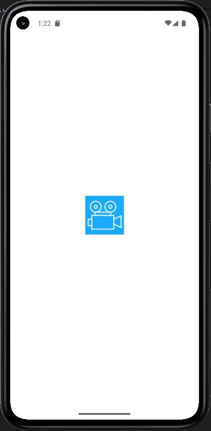
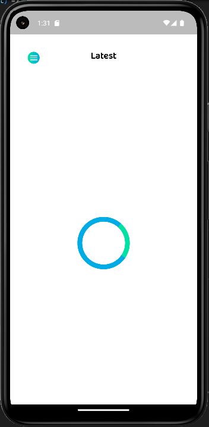
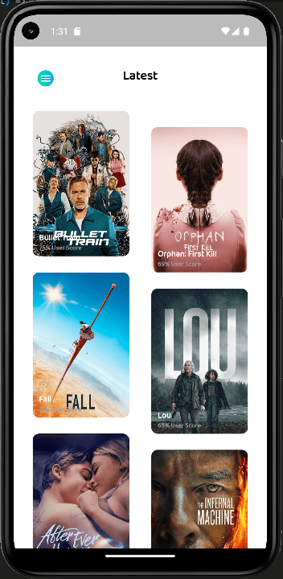
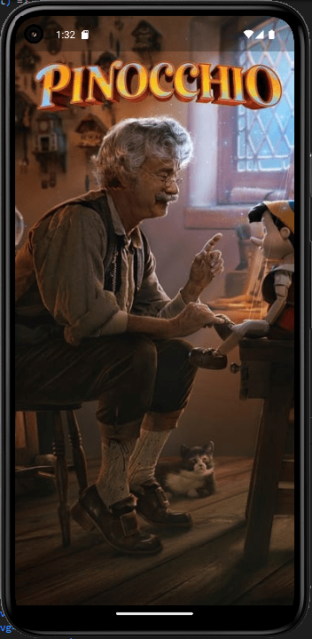
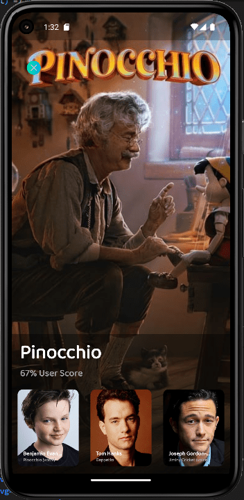
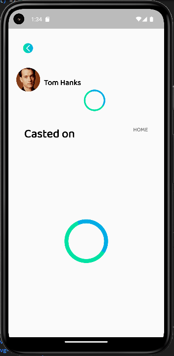
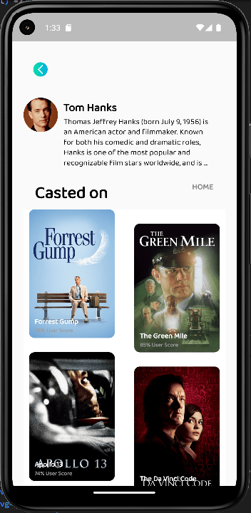
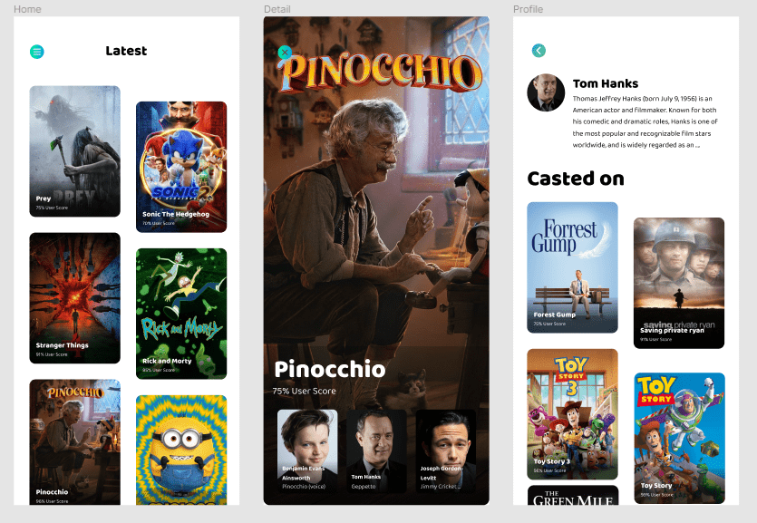

# :fire: movie_app :fire:

# :computer: Aplicación Android-IOS Desarrollada en Flutter para visualizar las Películas más Populares en las Carteleras de Cine :computer:

## :star: Introducción a la Aplicación :star:

Aplicación creada en Flutter usando el manejador de estado Bloc y la API de [TheMovieDB](https://www.themoviedb.org/) donde "The Movie Database" (TMDB) es una base de datos de películas y TV creada por la comunidad, aplicación creada como parte del proceso de selección de Desarrolladores Flutter para la empresa [AvilaTek](https://www.avilatek.com)

## :books: Tabla de contenido

- [Versiones](#memo-versiones)
- [Dependencias](#package-dependencias)
- [Instalación](#hammer_and_wrench-instalación)
- [Releases](#artificial_satellite-releases)
- [Apariencia](#camera-apariencia)
- [Uso](#rocket-uso) 
- [Soporte](#hammer_and_wrench-soporte)
- [Contribuciones](#memo-contribuciones)
- [Licencia](#scroll-licencia)

## :memo: Versiones

*  Versión de Flutter 3.3.2
*  Versión de la Aplicacion 1.0.0

## :package: Dependencias

* [google_fonts: ^3.0.1](https://pub.dev/packages/google_fonts)
* [http: ^0.13.5](https://pub.dev/packages/http)
* [flutter_dotenv: ^5.0.2](https://pub.dev/packages/flutter_dotenv)
* [flutter_bloc: ^8.1.1](https://pub.dev/packages/bloc)
* [equatable: ^2.0.5](https://pub.dev/packages/flutter_bloc)
* [bloc: ^8.1.0](https://pub.dev/packages/equatable)

## :hammer_and_wrench: Instalación

**Paso 0:**

Crea un archivo con el nombre de: `.env` (debe ser exacto) en el mismo nivel que el archivo `.gitignore` y agrega la clave de tu API de [TheMovieDB API](https://www.themoviedb.org/documentation/api) como se muestra debajo, sin espacios:

```sh
API_KEY=********Your_API_Key********
```

**Paso 1:**

Clonar el repositorio, use el siguiente comando en la temrinal:

```sh
git clone https://github.com/JeancarlosCarvajal/Prueba-Tecnica-AvilaTek 
```

**Paso 2:**

Limpiar las dependencias antiguas de Flutter (en caso que existan):

```sh
flutter clean
```

**Paso 3:**

Cargar las dependencias establecidas en el archivo pubspec.yaml:

```sh
flutter pub get
```

**Paso 4:**

Correr la aplicación con el comando:

```sh
flutter run
```
Luego la terminal te preguntará que dispositivo quieres desplegar y escoje uno y escribe el numero correspondiente, luego has click en enter.

## :artificial_satellite: Releases

* Para crear el release en Android debe seguir la documentación [Build and release an Android app](https://docs.flutter.dev/deployment/android).

* Para crear el release en IOS debe seguir la documentación [Build and release an iOS app](https://docs.flutter.dev/deployment/ios).


## :rocket: Uso

* Una vez tengas corriendo la aplicación, primero se desplegará la [pantalla principal](https://github.com/JeancarlosCarvajal/Prueba-Tecnica-AvilaTek/blob/master/appearance/3-min.png) que mostrará las peliculas más populares en cartera de cine, puedes bajar con el scroll y seguirás obteniendo peliculas a medida que existan más disponibles en la API.

* Al hacer touch sobre el ícono azul redondo (Menú Hamburguesa) en la parte superior izquierda de la aplicación se despliega una pantalla para colocar un menú de opciones de configuración y navegación según requerimientos futuros de la Aplicación.

* Puedes hace touch sobre alguna película de interes y te llevrá a la [pantalla de detalles](https://github.com/JeancarlosCarvajal/Prueba-Tecnica-AvilaTek/blob/master/appearance/4-min.png), donde verás la imagen principal de la película en pantalla compelta, luego si haces touch sobre la pantalla se despliegará los [3 actores más importantes](https://github.com/JeancarlosCarvajal/Prueba-Tecnica-AvilaTek/blob/master/appearance/5-min.png) de la película así como también un botón para ocularlos de la pantalla.

* Puedes hacer touch sobre el artista que quieras y te mostrará la siguiente pantalla donde se observará una [Biografía del artista](https://github.com/JeancarlosCarvajal/Prueba-Tecnica-AvilaTek/blob/master/appearance/7-min.png) y todas sus peliculas de cine realizadas y documentadas al momento en la API. Hay un pequeno texto color gris `HOME` al lado derecho de `Casted on` puedes hacer touch alli y te llevará de vuelta a la pantalla principal (No estaba en el UI pero lo consideré necesario para probar la navegación entre las pantallas).


## :camera: Apariencia









### :camera: UI de Guia para crear la Aplicación




## :hammer_and_wrench: Soporte

Por favor [open an issue](https://github.com/JeancarlosCarvajal/Prueba-Tecnica-AvilaTek/issues/new) para soporte.

## :memo: Contribuciones

Contribuye usando [Github Flow](https://guides.github.com/introduction/flow/). Crea una rama y realiza commits y [open a pull request](https://github.com/JeancarlosCarvajal/Prueba-Tecnica-AvilaTek).

## :scroll: Licencia

[MIT Licence © Jeancarlos Carvajal](https://github.com/JeancarlosCarvajal/Prueba-Tecnica-AvilaTek/blob/master/LICENCE.txt)